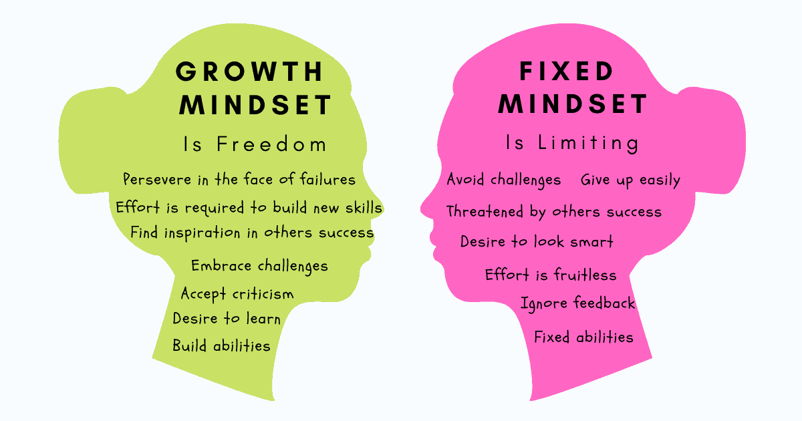

Bize hangi durumlarda, hangi konuda iyi olduğumuz söyleniyor? ya da hangi konuda zayıf olduğumuz söyleniyor? Peki iyi olduğumuz söylenen konularda neden iyiyiz? Doğuştan bir hediye mi? İlgili konuda iyi olmak için çok efor mu sarf ettik? Daha önce deneyip, başarısız olduğumuz için mi kötüyüz? Yoksa hiç denemediğimiz için mi? ya da defalarca deneyip, her seferinde başarısız olduğumuz için mi?
 <!--more-->

Bir şeyde iyi ya da kötü olmaya yönelik mesajlar dışarıdan geldiği kadar kendi içimizden de geliyor olabilir! Özellikle içinde "olmak", "olgu" gibi kelimeleri taşıdığından, bir noktada doğrudan hayatla kurduğumuz ilişki, bu ilişkinin yürütüldüğü kimlik ile de doğrudan ilintili bir hal alıyor. 

<h2>Geribildirim Tarzı Önemli</h2>

Belki de, kimliğe bağlı geribildirimlerin, daha fazla reflekse yol açıyor olmasının, bu açıdan bir anlamı var. Örneğin, kişiye feedback verirken kullandığımız zeki, akıllı, yetenekli, çok bilgili, gibi mesajlar doğrudan kimlikle bağ kuruyor. Dolayısı ile doğrudan bir yük yüklüyor. Artık karşıdaki kişinin varlığını bu feedbacklerle özdeşleştirdiğimiz için, bu feedbackleri zora düşürecek şeyler, kişinin varlığı ile alakalı refleksleri tetikliyor. 

Geribildirimler kimliğe ve dolayısıyla varlığa değil, efora yönelik de verilebilir. Çok çalışmak, her şeye rağmen pes etmemek, ilgili zorluklara yönelik gösterilen tavıra ve sürece yönelik de olabilir. 

Hangi türde olursa olsun, aslında bu geribildirimler, bizim neyi başarabileceğimize yönelik temel inançlarımızla tamamen entegre haldeler. 

Carol Dweck ve Claudia Mueller, bu iki farklı yaklaşımı çocuklar üzerinde araştırmak için deneysel bir çalışma başlatıyorlar. Bu çalışmada, bir grup çocuğa doğrudan kimlikle bağdaşacak geribildirimler veriyorlar, bir başka gruba efor ve süreci ön plana çıkaran geribildirimler veriliyor. Son olarak, kontrol grubuna ise, herhangi bir geribildirimde bulunulmuyor. 100'den fazla çocukla yapılan çalışmanın sonuçları hayli ilginç!

Feedback alan çocuklara özgürce problem seçebilecekleri alan tanındığında, kimlik odaklı geribildirim alanların, yalnızca iyi oldukları konulardaki problemleri çözme eğiliminde oldukları görülüyor. Övülmeye devam etmek, varoluşsal bir tehdit hissetmemek vb gibi düşünceler, ek kaygı yükü oluşturuyor. 

Efor ve süreç üzerinden geribildirim alan, övülen çocukların ise, daha zor problemleri seçtikleri gözlenmiş

Sadece zorluk derecesi değil, kimlik odaklı geribildirim alan çocukların aynı zamanda, sayıca da daha az problemle yüzleşmek istedikleri görülmüş. 

Yine bu gruplara, bilişsel beceri testleri yapılmış ve ilk testlerde tüm gruplar benzer test sonuçları almışlar. Buna karşın, ikinci test öncesinde kimlik üzerinden övgüye maruz kalan öğrencilerin ikinci testlerinin skorlarında belirgin bir düşüş gözlenmiş. Efor odaklı övgü alan öğrencilerin ikinci testlerinde ise belirgin bir yükseliş gözlenmiş. 

Daha da ilginci, bu öğrencilere performanslarını diğerlerine açıklamaya yönelik bir talepte bulunulduğunda, benzeri kaygılarla, kimlik odaklı övülen grubun, saklanma ve yalan söyleme eğilimlerinin çok daha fazla olduğu görülmüş. 

<h2>Nöroplastisite</h2>

Geribildirimler önemlidir dedik çünkü, Heidegger'ın "Dasein" kavramı ile açıklamaya çalıştığı gibi, dünya ile sürekli etkileşim halindeyiz. Bir şey olma süreci aslında dünya ile kurduğumuz anlam ilişkileri ve etkileşimler üzerinden şekilleniyor. 

Nöronlar beyinde elektrik ve kimyasal sinyallerle haberleşiyor. Dendridler gelen sinyalleri çekirdeğe iletiyor, çekirdek bu sinyalleri bir araya toplayıp aksona iletiyor, son olarak akson bu sinyalleri işleyerek sinapslara gönderiyor. Sinapslar ise sinyalleri diğer sinir hücrelerine iletiyor. Normalde nöronlardaki iletim hızı saniyede 50 santimetre kadarken, bu aksonları çevreleyen ve koruyan miyelin kılıfı oluşmuş nöronlardaki iletim hızı 240 kata kadar daha fazla olabiliyor. 

 
  

    
     
    <em>Ranger Class 19</em>
  

 

Eskiden beyin hücrelerimizin sayısının sabit ve değişmez olduğu düşünülürdü. 1900'lerde ilk kez sinirbilimci Cajal, beynin yetişkinlikte de gelişebileceğine inanıyordu. 1960'larda, nöronların travmalardan sonra tekrar organize olarak fonksiyonel hale gelebilecekleri gösterildi. Yine stresin yalnızca beynin fonksiyonelitesini değil, yapısını da değiştirebileceği gösterildi. 

Tüm bu araştırmalar sonucunda, aslında beynin ölebileceği, yeni bağlantılar oluşturabileceği, hatta yenilenebileceği başka yolların olabileceği görülmüş oldu.

Farklı kafesler içerisinde büyüyen ikiz farelerden, tecrübece zengin olanaklar sunan kafesteki farenin, daha akıllı, fiziksel olarak daha sağlıklı ve dahası beyinleri incelendiğinde daha büyük ve ağır olduğu görüldü. 

Aynı iletim yollarının istikrarlı bir şekilde kullanılması, miyelinleşme sürecini de katkı sağlar. 

İşte nöroplastisite, bizim çevremizle olan bu etkileşimlerimiz sonucunda, beyinde oluşan fiziksel değişimlerdir. Değişen durumlara adapte olmamızdan, yeni şeyler öğrenmemize kadar geniş yelpazede bir etkiden söz ediyoruz. 

>Yazılım güncellemesine ek olarak beynin donanım güncellemesi de alabildiğini düşünün!

<h2>"Henüz"ün Gücü</h2>

Mindset(Zihniyet), genel anlamda hayat felsefemiz, duruşumuz ve bakış açımızdır dersek çok yanlış olmaz. Carol Dweck, mindseti iki farklı sınıfa ayırır; sabit(fıxed mindset) ve gelişim(grwoth mindset).

Sabit zihniyet, kimliklere bağlanan geribildirimlerle inşa edilmiş, toplumsal konumu odağına alan, limitlerden oluşan, sahip olunanı korumak adına, maksimum düzeyde hatadan kaçınılan ve "başarı" odaklıdır.

Buna karşın, gelişim zihniyeti, eforları ödüllendiren, nöroplastisitenin gerçekliğini bilen ve adapte olup efor sarf ettiğinde, gelişeceğine ve her zaman daha iyi olabileceğine inanır.

Efor odaklı ilerleyen bu sürecte Carol Dweck, "şimdi"nin zorbalığındansa, "henüz"ün gücünü kullanmanın öneminden bahseder. Yapamamanın aksine "henüz değil" bir korsu gösterir. Bir tavrı ve yolu vurgular. Yalnızca bu tutum değişimi bile, nöroplastik gelişimi tetiklemeye başlar. 

Yine gerçekleştirilen deneylerde, özellikle fixed mindset üzerinden hayat ile ilişki kuranlar üzerine ilginç sonuçlar elde etmişler. 

* Çalışma yerine, kopya eğilimi çok daha fazla
* Bulundukları ortamda, daha iyi hissedebilmek için, kendilerinden kötüleri arıyorlar
* Zorluklarla karşılaşıldığında kaçıyorlar

Yine bilim insanları, zorluklar ile karşılaşmış kişilerin beyinlerini ölçüyorlar, fixed mindset ile growth mindset arasında ciddi elektrik aktivitesi farkı gözlüyorlar. 

<h2>Eforun ve Zorlukların Anlamını Değiştirmek</h2>

Amerika'da bazı okullarda growth mindset pilot sınıfları oluşturulmuş. Özellikle de başarısızlığın bir kader olarak görüldüğü bölgelerdeki okullar içerisinden bu sınıflar seçilmiş. Öğrencilere, zeka, yetenek gibi özelliklerin sabit ve kalıcı olmadığı, başarının da sadece bunlara bağlı olmadığı inancı aşılanmış. Feedbackler ve övgüler doğrudan efora, gelişime, vazgeçmemeye, zorluklarla başa çıkmayı seçmeye, adaptasyon çabalarına yöneltilmiş. Öğrencilerin, kendileri ile kurdukları ilişkilerde de bu yönlendirme yapılmış. 

Uzun süreli bu çalışma sonunda 

* Harlem New York'da seçilen okulda skorlar 95'e çıkmış
* South Bronx New York'da seçilen okulda, 4. sınıflar ciddi şekilde geridelermiş. Çalışma sonunda, matematik testinde New York genelinde en iyi sınıflardan birine dönüşmüşler
* Native American Reservation ise kendi bölgesinde top seviyeye yükselmiş 1 yıl içerisinde 

Uğraştığımız konu ne olursa olsun, aslında günün sonunda problem çözüyoruz. Problemler karşısındaki duruşumuz, onlara atadığımız anlam, gösterdiğimiz tavır, problemler ile ilişkimizin en net hali. Burada yapılacak küçük değişiklikler, beyinde sadece fonksiyonel değil, fiziksel değişimleri tetikliyor (Nöroplastisite). 

Öyleki, bu gün nöroplastisite, miyelinizasyon sürecini daha fazla tetikleyerek bazı demiyelinizasyon nedenli hastalıkların tedavi edilmesinde de kullanılıyor. Demiyelinizan durumlardan en bilineni MS hastalığıdır. Ancak aşağıdaki bazı diğer hastalıkların da miyelin ile bağlantılı olduğu biliniyor

* Depresyon
* Dikkat Eksikliği ve Hiperaktivite (ADHD)
* Bipolar Bozukluk
* Disleksi
* Obsesif Kompulsif Bozukluk
* Bilişsel Düşüş
* Şizofreni
* Otizm

Bu hastalıkların kontrol altına alınması ve tedavisinde miyelini korumak ve ve yenilemek için çaba gösteriliyor. En basiti, MS hastalarına ketojenik diyet uygulanmasındaki bir neden miyelini korumak ve artırmak. Yapılan bazı çalışmalarda keton üretiminin artmasının, miyelin üretiminin artmasına da yardımcı olduğu gözlenmiş. 

<h2>Niye Anlatıyorum?</h2>

Bütün bunları neden anlatıyorum? Cyber Struggle için geliştirmiş olduğum ve halen üzerinde iyileştirme çalışmaları yaptığım eğitim metodolojisinde kullandığım, esinlendiğim, odağıma aldığım şeyler hakkındaki düşüncelerimi buraya yazmaya karar verdim. Daha makale formatına çevirmeye zaman oldukça kendi websitesine de o halini koyarım diye düşünüyorum. 

Bu arada, bir taraftan kendi kendime tartıştığım şeyler ilginizi çekerse gelip okumuş olurken, bir tarafta Ranger programı başta olmak üzere, CS bünyesinde neyi neden yapmaya çalıştığımız konusunda da daha fazla izleniminiz olabilir. 

<h2>Cyber Struggle Ranger Programı ve Growth Mindset</h2>

Ranger programının ilk hedefi, programa katılan personelin sabit zihin semasını çıkarmak. Bu şemayı yalnızca eğitmenler ve sistem olarak bizim çıkarmamız yeterli değil. Aynı zamanda program boyunca, bu şemayı katılımcıların kendi kendilerine ortaya çıkarmalarına destek olmaya çalışıyoruz. 

Ortaya çıktıktan sonraki aşamada, bütün bunların fixlenmiş ve kimliğe bağlı şeyler olduğu gerçeğinin farkındalığını yaşatmaya çalışmak var. Bu süreç aslında, katılımcıların erken aşama limitlerine doğru itilmesi ile başlıyor. Her ne kadar metodolojik bir zorunluluktan bahsediyor olsak da, Ranger programını üst üste iki kez gelenler için bile farklı bir tecrübeye dönüştüren şeylerden birisi burada saklı. Sistem her katılımcıyı kendi tecrübesi üzerinden fixed mindset ile buluşturmaya çabalıyor. Bu da her bir kişi için ayrı bir yol haritası ve tekil bir tecrübe demek. 

Kimileri iyi olduğunu, kimileri zeki olduğunu, kimileri kronik başarısız olduğunu düşünebilir. Burada önemli olan şey, düşüncelerin kimlikle ilintili bir halde olması, pozitif ya da negatif duygular barındırması değil. Katılımcının odağını "yeterlilik" konseptinden "henüzün gücü" tarafına kaydırmak amacımız. 

Bu farkındalığa ek olarak, Ranger programı boyunca değişen durumlar yaratılıp, bu durumlara adapte olunması bekleniyor. Değişen her durum, beraberinde -önceden ortak planlama yapılmadıysa- belirsizlik ve stres getirir. Bu yüksek adaptasyon bekelentisi ise, odak değişimine ek olarak bir nöroplastisite sürecini tetikletiyor. En azından tetikletmesini bekliyoruz. 

Bu iki konu paralel bir şekilde, dozajı program boyunca eğitmenler tarafından oynanarak yaşatılırken, katılımcıların zaman zaman belli konularda çok iyi oldukları hissine kapılmaları, bazen çok kötü oldukları hissine ve düşüncesine kapılmaları ve bunların sürekli olarak farklı ve uygun dozlarda birey bazında değiştirilmeleri sağlanıyor. Bu akış ise, katılımcıların bir süre sonra problemleri eforlar, zorluklar ve anlamlar üzerinden değerlendirmelerini sağlıyor. Kişiler kimlik odaklı sabit düşüncelerden ayrılmaya (detach) başlıyorlar. Geribeslemeleri, ödüllendirilmeleri, övgüleri süreç ve efor odağına kayıyor.

Problem yoğunluğunu artırarak, tekrar sayısını artırmış da oluyoruz. Bknz miyelinizasyon! Öte yandan, verilen problemler çoğu durumda, katılımcıların çözümlerine hakim olmadıkları bir form ile veriliyor. Program öncesinde, sınıf için bir seviye belirleme yapılmadığından, sınıfta ilgili problemlerin çözümünü bilen kişiler de olabiliyor. Bu durumda da, "bilgili kişinin" pozitif fixed zihin yapısından ayrılması bekleniyor. Buradan birkaç çeşit şekilde ayrılma imkanı var. Bunlardan ilki, konuda daha fazla derinleşmek! Verilen problemin cevabının ötesine geçerek, kendisinin daha iyi bir versiyonu ile çözmek. Bir diğeri ise, ekip! Ekipteki diğer katılımcıların hikayelerinin bir parçası olarak, insan odaklı beceriler çerçevesinde growthda kalmak. 

Tabi burada, Jean-Paul Sartre'nin "varoluş özden önce gelir" söylemi ve özgürlük ilişkisi devreye giriyor. "İnsan önce var olur, sonra kendi kimliğini yaratır" der Sartre. İşte bu kimliği belirleme gücü insana özgürlük verir. Bu özgürlükle alınan kararlar, kişinin varoluşunu anlamlandırır. 

Bazen "iyi bilen" katılımcılar yukarıda bahsettiğim şekli tercih ederek, kendi büyüme ekseninde kalarak, aynı zamanda başkalarının hikayelerinde de yer almayı tercih ederler. Bazen de, tam tersi, programın bir şey katmayacağını düşünüp ayrılabilirler programdan. Bütün bu seçimleri yaşadık ve tecrübe ettik farklı kişilerle. 

Yine Ranger Programı boyunca, çeşitli periyodik görevler verilir. Bu görevlerin bir kısmı duygu durum kontrolü için nöroplastisite tetiklemeye çalışırken, bir kısmı kritik düşünme, vaka formülasyonu, otomatik düşünceler, ara inançlar ve temel inançların keşfi ve değişimi yahut anahtar kognisyon için nöroplastisite tetiklemeyi hedefler. 

Bütün bunların koordine bir şekilde tecrübe ediliyor olması, katılımcıyı fixed mindsetten growth mindsete taşımaya, duyguları daha iyi regüle eden, yeni davranışlar ve alışkanlıklar oluşturabilen, zorluklar karşısında daha az yılma eğilimi gösteren, bilinmezliğe karşı daha dirençli, krizlerde ve sorunlarda büyüme fırsatı gören, problem çözme becerileri gelişmiş kişiler olmalarına destek oluyor. 

Peki bir siber güvenlik eğitimi için bunların ne önemi var? Yaygın problemler ve bunların nasıl çözüleceğini anlatmak, çözümleri formüle etmek, formülleri de katılımcılara sağlamanın nesi kötü?

Bunun yanıtı için de birçok farklı perspektif baz alabilirim. 

* Metodolojik Kronik Perspektif: Her şeyden önce, yüzlerce eğitim var, bir çoğu bedava ve/veya bedavaya yakın. Ama hala insan kaynağı sorunundan bahsediyoruz. Hem nicel hem nitel. Demek ki, sorun eğitimlerin sayısı ya da erişilebilir olmasından daha köklü. Üstelik, bu tür eğitim almış ve meslek icra etme aşamasına gelmiş kişilerin çok daha azı, yaratıcılık, esneklik, problem çözme, yüksek etki yaratma, beklentilerin ötesine geçme gibi konularda etkin. 
* Öğrenme Perspektifi: Bütün, parçalarının toplamından daha büyüktür. Büyüme odaklılığın, öğrenme üzerinde ciddi etkisi var. Kimisi hemen farkedilirken, kimisini farketmek için belli şeyler tecrübe etmek gerekebilir. 
* Fonksiyonalite Perspektifi: Problem, meydan okuma üzerinden gelişim sağlandığı ve efor odaklı oluşu, aynı zamanda insanın becerilerinin sabit olmayışına olan inanç, bireyi otomatik olarak fonksiyonalite odağında tutar. Kimlik odaklı "iyi olmak", "iyi bilmek" vb şeylerden ziyade, daha çok sorun çözmek, daha yüksek etki yaratmak, daha fazla gelişmek gibi. 
* Kendi Varoluşumu Anlamlandırmak: Daha iyisini arama ve yapma gayreti ve cesareti 

<h2>Kaynakça</h2>

* C. Mueller and C. Dweck, (1998), Praise for Intelligence Can Undermine Children's Motivation and Performance"
* D. Laskowitz, et al. (2015). Translational Research In Traumatic Brain Injury.
* K. T. Sibille, et al. (2016). Increasing Neuroplasticity To Bolster Chronic Pain Treatment: A Role For Intermittent Fasting And Glucose Administration?.
* W. Turakitwanakan, et al. (2013). Effects Of Mindfulness Meditation On Serum Cortisol Of Medical Students.
* A. C. Rodrigues, et al. (2010). Musical Training, Neuroplasticity And Cognition
* E. Fuchs, et al. (2014). Adult Neuroplasticity: More Than 40 Years Of Research.
* Nussbaum, A. D., & Dweck, C. S. (2008). Defensiveness Versus Remediation: Self-Theories and Modes of Self-Esteem Maintenance. Personality and Social Psychology Bulletin
* Hong, Y.-y., Chiu, C.-y., Dweck, C. S., Lin, D. M.-S., & Wan, W. (1999). Implicit theories, attributions, and coping: A meaning system approach. Journal of Personality and Social Psychology
* Moser JS, Schroder HS, Heeter C, Moran TP, Lee YH. Mind your errors: evidence for a neural mechanism linking growth mind-set to adaptive posterror adjustments. Psychol Sci. 2011 

